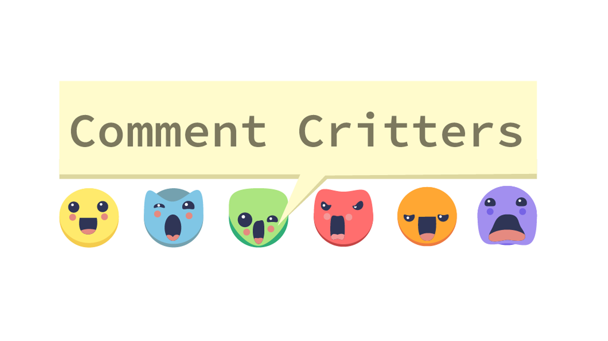
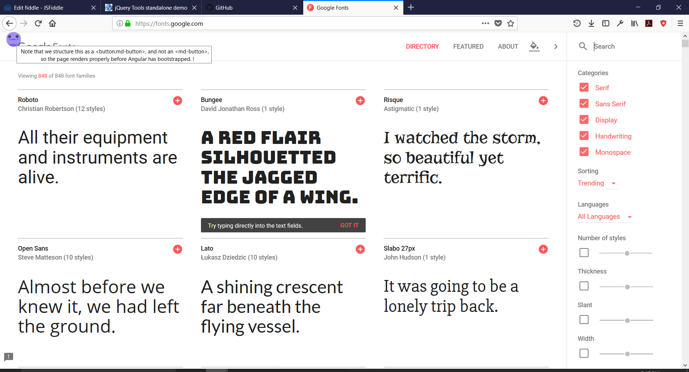

# Comment Critters

Webextensions plug-in that displays HTML comments directly on the page with cute characters.

Chrome and Edge extensions are currently not live due to store restrictions, but source code is provided here if you want to try it out (for Edge, use the 'firefox' files). For FireFox users, the published extension can be found [here](https://addons.mozilla.org/en-US/firefox/addon/comment-critters/)

## Examples
See it in action! If you want to try it for yourself, build the appropriate files for your browser and run the plugin. If you use firefox, you can just download from the store  [here](https://addons.mozilla.org/en-US/firefox/addon/comment-critters/).

## To-do
- Update tooltip styling

## Bugs
- Breaks styling on some sites.
